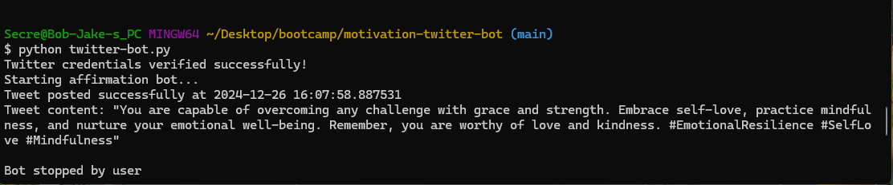
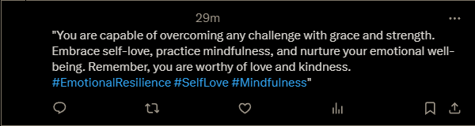

# Motivation Twitter Bot

## Description

A bot that makes scheduled posts of generated content and responds to comments. Designed to spread positivity. This bot written in Python using OpenAI API and X API (TwitterAPI).

## Table of Contents

- [Installation](#installation)
- [Usage](#usage)
- [How to Contribute](#how-to-contribute)
- [Tests](#tests)
- [License](#license)
- [Questions](#questions)

## Installation

Install dependencies and then run the python file.

## Usage

### Sceenshot Demo

### Usage Information
Run the python file for Twitter Bot to automate your social media marketing operations.

## How to Contribute

Contribute freely! Please add comments and create a Github issue.

## Tests

N/A

## License 
This application is covered under MIT License.
See the [full license](https://opensource.org/licenses/MIT) for more information.

## Questions

To reach me with additional questions please message me on either GitHub at jake-magri or via email jake.magi2@gmail.com.